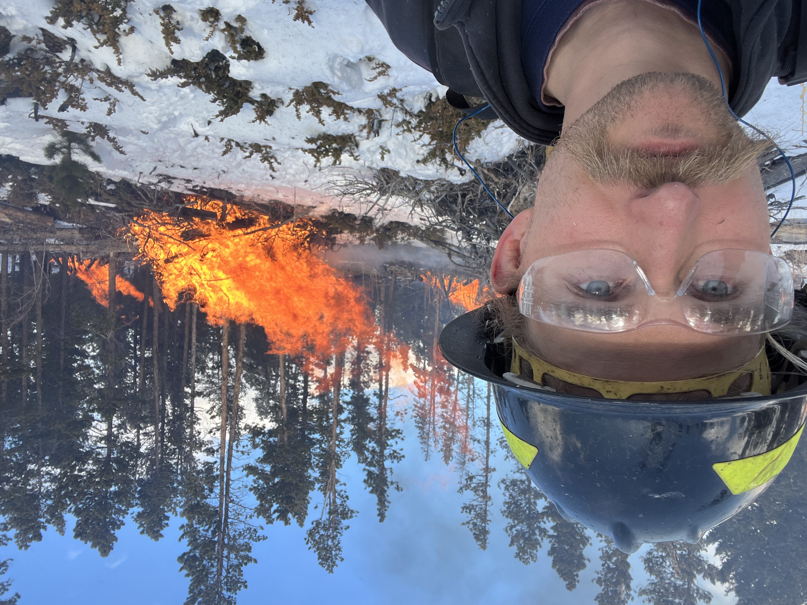

# Earth Data Science portfolio: GIS, Environmental Science, and Wildfire Mitigation
* almo1024@colorado.edu
* https://www.linkedin.com/in/allen-michael-moench-b04a6465/
  
### Background & Introduction
Hello! I'm Allen Moench (I usually go by Michael). I graduated with a B.A. from Western Washington University back in 2013. While at school there I self-designed a program of study that focused on Sustainability through the lenses of Human Systems, Natural Systems, and Communication. As part of this I pursued a minor in Environmental Science which allowed me to examine many different "layers" of the environment. I took classes in biology, chemistry, ecology, geology, water quality, climate change, oceanography, and environmental systems among others. 

After graduating I worked in a wide variety of roles including landscaping, construction, and child and elder care. I also traveled and lived abroad for some time in south and southeast Asia. More recently I moved back to Colorado at the end of 2021, and worked as a wildland firefighter practicing wildfire response, suppression, and mitigation. Last spring I began a certificate program with Front Range Community College studying Foundations of Geographical Information Systems, which I completed at the end of this summer. I am currently working as a GIS technician with a company called Actalent.

I have several goals in studying Earth Data Analysis. In particular, I want to research climate solutions. By this I mean not simply lowering humanity's CO2 output (although this is important), but a diverse array of innovations that benefit society on multiple levels. I want to research these solutions in a deep, technical, and rigorous manner so that they can be applied throughout society and help us all move towards an ideal, sustainable future. I'm looking into grad school at CU, and I'm excited to connect with the larger community of evnironmental and data scientists here in Boulder. If you see something in my work that you like, please get in touch!

#### Earth Data Analysis projects in Python

The following are some projects from my Earth Data Analysis class at CU Boulder. Be aware - some of these are works in progress! I'm fairly new to python, so my coding and my methods might still need some work. I'm always open to feedback and comments on this, so please alert me if you see something.

[First Map assignment](https://allenmoench.github.io/first_map.html)

[Climate Coding: Sondrestrom, GL](https://allenmoench.github.io/climate_12_portfolio_03(2).html)

[Species Migration: Megaptera novaeangliae](https://allenmoench.github.io/whale_migration2.html)

[Habitat Suitability: Sorghastrum nutans](https://allenmoench.github.io/habitat_suitability_portfolio_01(2).html)

[Habitat Suitability: Andropogon gerardii](https://allenmoench.github.io/Hab_suit_revised.html)

[Fourmile Canyon Subwatershed](https://allenmoench.github.io/clustering_03_portfolio.html)

[Complicated Complexes!](https://allenmoench.github.io/complicated_complexes_blog.html)

[Chicago Redlining](https://allenmoench.github.io/big-data.html)

This one is a Vector GIS project:

[Gold Hill Wildfire "risk"](https://allenmoench.github.io/gh_wildfire_report.html)
